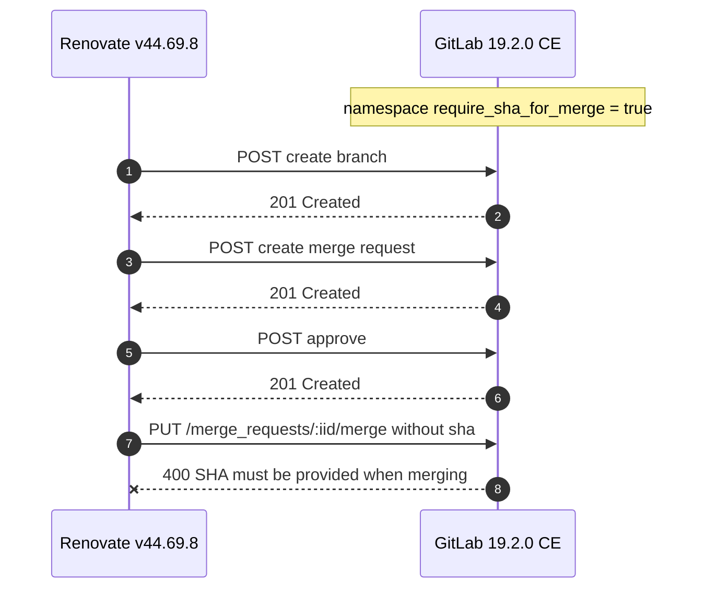

# Runbook: Renovate automerge failures with GitLab `require_sha_for_merge`

Renovate automerge against the self-managed GitLab instance failed with `400 {"message": "SHA must be provided when merging"}`:
GitLab 19.2 introduced the namespace setting `require_sha_for_merge` (defaulting to `true` for newly created groups), and Renovate does
not send the `sha` parameter when merging. The immediate fix was to disable the setting via `gitlab-rails console`; the long-term fix is
pending upstream in Renovate.

## Incident record

| Field        | Value                                                                                                    |
| ------------ | -------------------------------------------------------------------------------------------------------- |
| Status       | Resolved (workaround in place, long-term fix pending upstream)                                           |
| Documented   | 2026-09-11                                                                                               |
| Environment  | TuringPi cluster, Kubernetes namespace `gitlab-next`, ArgoCD app `renovatebot-turingpi`                  |
| Components   | Renovate v44.69.8 (Helm), GitLab 19.2.0 CE (revision `aa5f2af0b46`, `enterprise: false`)                 |
| Endpoint     | `https://gitlab-internal.spirit-dev.net/api/v4`, platform `gitlab`, `autodiscover` enabled               |
| Impact       | Zero automerges succeeded across all autodiscovered repositories; branch/MR/pipeline creation unaffected |
| Owner        | Infrastructure team                                                                                      |

## Table of contents

- [Quick fix (TL;DR)](#quick-fix-tldr)
- [Symptoms](#symptoms)
- [Root cause](#root-cause)
- [Investigation timeline](#investigation-timeline)
- [Resolution](#resolution)
- [Workaround: manual merges with the `sha` parameter](#workaround-manual-merges-with-the-sha-parameter)
- [Long-term fix and follow-ups](#long-term-fix-and-follow-ups)
- [Diagnostics snippets](#diagnostics-snippets)
- [References](#references)

## Quick fix (TL;DR)

On the GitLab host, open the Rails console and flip every namespace that explicitly requires a SHA back to the application default (`false`):

```ruby
# On the GitLab host: gitlab-rails console
NamespaceSetting.where(require_sha_for_merge: true).update_all(require_sha_for_merge: false)
```

- No GitLab restart is required.
- Verified by re-running a sha-less merge probe afterwards: HTTP 400 before, HTTP 200 after (see [Verification probes](#verification-probes)).
- This is a workaround, not a fix: Renovate still omits `sha`.
  Track [renovatebot/renovate PR #44803](https://github.com/renovatebot/renovate/pull/44803) and bump the image once released
  (see [Long-term fix and follow-ups](#long-term-fix-and-follow-ups)).

## Symptoms

Renovate (v44.69.8, `platform: gitlab`, endpoint `https://gitlab-internal.spirit-dev.net/api/v4`, `autodiscover` enabled) created branches, merge requests, approvals and pipelines normally, but every automerge attempt failed.

### Log signature

Recurring signature in the pod debug logs (captured at the repository root, e.g. `renovatebot-debug-2xnxs.log`; enable with the already-staged `LOG_LEVEL: "debug"` env var in `helm/values.turingpi.yaml`):

```text
Automerging #36 with strategy auto
PUT /api/v4/projects/<url-encoded-path>/merge_requests/<iid>/merge → HTTP 400
{"message": "SHA must be provided when merging"}
```

- The request body sent by Renovate was exactly `{"should_remove_source_branch":true}` — no `sha`, no `merge_when_pipeline_succeeds` (direct `mergePr` path, not the branch-automerge path).

### Affected merge requests

Seen 8 times across the autodiscovered repositories:

| Project path                         | MR  | Note                                |
| ------------------------------------ | --- | ----------------------------------- |
| `infrastructure/helm/vikunja`        | !36 | subgroup of `infrastructure/helm`   |
| `n8n`                                | !9  | top-level group                     |
| `application/gh-years-in-review`     | !91 |                                     |
| `xarr/rustatio`                      | !31 | subgroup `infrastructure/helm/xarr` |
| `templates/gitlab/repository-assets` | !12 |                                     |

### What still worked

The merge requests themselves were perfectly mergeable — `merge_status` `can_be_merged`, pipeline `SUCCESS`, no conflicts, approvals applied. Only the final merge API call was rejected.

## Root cause

### The GitLab setting

- GitLab 19.2 introduced a cascading namespace setting `require_sha_for_merge` ("Require SHA when merging"). It is a race-condition
  hardening that rejects `PUT /merge_requests/:iid/merge` calls lacking the `sha` parameter with exactly
  `400 {"message":"SHA must be provided when merging"}`.
- Introduced via [gitlab-org/gitlab!236732](https://gitlab.com/gitlab-org/gitlab/-/merge_requests/236732);
  application-level support via [gitlab-org/gitlab!239418](https://gitlab.com/gitlab-org/gitlab/-/merge_requests/239418)
  (merged 2026-07-03, milestone 19.2).
- Groups created **after** the 19.2 change default to `require_sha_for_merge: true`.

### The Renovate gap

- Renovate's GitLab platform code omits `sha` on both merge paths (`mergePr` and `tryPrAutomerge`). On affected namespaces, Renovate can create and approve merge requests but can **never** merge them.
- Upstream fix: [renovatebot/renovate PR #44803](https://github.com/renovatebot/renovate/pull/44803)
  "fix(platform/gitlab): send sha on merge to support require-sha namespace setting" (open as of 2026-09-11, not yet merged).
  It adds `sha` to both merge paths; the `sha` parameter is supported since GitLab v11, so the change is backward compatible.

### Why this instance was affected

- Top-level groups `templates` (id 36), `infrastructure` (31), `application` (29) and `scripts` (34) were all created 2026-08-04 —
  after the 19.2 change — and therefore defaulted to `true`. Subgroups (`templates/gitlab`, `infrastructure/helm`,
  `infrastructure/helm/xarr`, ...) inherited or held `true` as well.
- The application-level default was already off (`GET /application/settings` returned `require_sha_for_merge: false`,
  `lock_require_sha_for_merge: false`), yet merges still failed. Explicit per-namespace `true` rows win over the application
  default in the settings cascade.



## Investigation timeline

1. **Renovate config verified correct (ruled out).** The presets chain (`templates/gitlab/repository-assets/renovate.json` →
   `local>templates/renovate-config//renovate/default`) enables `:automergeMinor`; the resolved config showed `platformAutomerge: true`,
   `automergeType: pr`, `automergeStrategy: auto`. Not a config problem.
2. **Merge request state verified mergeable (ruled out).** API checks showed nothing blocking: `merge_status` `can_be_merged`, pipeline `SUCCESS`, no conflicts. Only the merge call itself was rejected.
3. **External research.** Identified the `require_sha_for_merge` namespace setting and the open Renovate fix PR ([#44803](https://github.com/renovatebot/renovate/pull/44803)).
4. **API remediation attempts — all silently failed on 19.2.0 CE:**

   | Attempt                                                  | Result                                                                                                                     |
   | -------------------------------------------------------- | -------------------------------------------------------------------------------------------------------------------------- |
   | `PUT /groups/:id` with `require_sha_for_merge: false`    | HTTP 200 but a **no-op** — the API silently discards the undeclared parameter (misleading 200s).                           |
   | `GET /application/settings`                              | App default already `false` and unlocked, yet merges still failed → explicit per-namespace `true` rows win in the cascade. |
   | Sweeping all 17 groups via the API, then retrying merges | Still HTTP 400 — conclusive: **the groups API cannot change this setting on 19.2.0 CE.**                                   |

5. **Working fix applied via `gitlab-rails console` on the GitLab host** (2026-09-11), confirmed by the operator — see [Resolution](#resolution).

## Resolution

Applied in `gitlab-rails console` on the GitLab host (user confirmed it worked):

```ruby
# Fix: flip all explicit true rows back to false
NamespaceSetting.where(require_sha_for_merge: true).update_all(require_sha_for_merge: false)
```

- No GitLab restart needed.
- Verified by re-running a sha-less merge probe → HTTP 200 (see [Verification probes](#verification-probes)).
- To diagnose a single failing project or list affected namespaces before/after the change, see [Diagnostics snippets](#diagnostics-snippets).

## Workaround: manual merges with the `sha` parameter

Manual merges via the API work regardless of the setting — fetch the head SHA from `diff_refs.head_sha` and pass it as `sha` (this also removes the merge race the setting guards against):

```bash
GITLAB="https://gitlab-internal.spirit-dev.net/api/v4"
SHA=$(curl -s --header "PRIVATE-TOKEN: $GITLAB_ADMIN_TOKEN" \
  "$GITLAB/projects/<url-encoded-project-path>/merge_requests/<iid>" | jq -r '.diff_refs.head_sha')

curl -s -w "\nHTTP %{http_code}\n" -X PUT \
  --header "PRIVATE-TOKEN: $GITLAB_ADMIN_TOKEN" \
  --header "Content-Type: application/json" \
  -d "{\"sha\": \"$SHA\", \"should_remove_source_branch\": true}" \
  "$GITLAB/projects/<url-encoded-project-path>/merge_requests/<iid>/merge"
```

## Long-term fix and follow-ups

### Track the upstream Renovate fix

- Track [renovatebot/renovate PR #44803](https://github.com/renovatebot/renovate/pull/44803). Once merged and released, bump the Renovate
  image version in this repository: `renovate.image.tag` in `helm/values.yaml` (currently `44.69.8`, mirrored by `Chart.yaml`
  `appVersion` via the `# renovate: datasource=github-releases depName=renovatebot/renovate` comment; check per-env overlays
  such as `helm/values.turingpi.yaml` for overrides).
- After the bump, the `require_sha_for_merge` hardening can be re-enabled if desired.

### Re-enabling the hardening later

- Once Renovate sends `sha` natively, flip the affected namespaces back to `true` (rails console) — or leave the rows at `false` and
  enable/lock the setting at the application level, then re-run the [verification probes](#verification-probes) with an updated
  Renovate run.

### Alternative: automergeType branch

- If the hardening must stay enabled before the upstream fix ships: set `"automergeType": "branch"` in the Renovate preset. Renovate then pushes directly to the default branch — no merge API call — so the `sha` requirement never triggers.
- Trade-off: no merge request and no pre-merge pipeline gate for automerged updates.

### Re-triggering Renovate manually

After config or setting changes, force a run:

```bash
kubectl -n gitlab-next create job --from=cronjob/renovatebot-turingpi renovatebot-manual-$(date +%s)
# Confirm the exact CronJob name first: kubectl -n gitlab-next get cronjobs
```

### Security follow-ups

- During the investigation, live tokens were found committed in plaintext: the bot token and a GitHub PAT in
  `helm/values.turingpi.yaml`, and a temporary admin token in `script.sh`. All of them must be rotated/revoked; move secrets to
  Vault Secrets Operator / KSops per house conventions.
- The bot token also returned `401` mid-session (rotated/revoked server-side). A dead bot token breaks the whole Renovate run, not just automerge — check for `401` responses early when debugging "everything fails" runs.

## Diagnostics snippets

### Walk the namespace hierarchy

Diagnose the cascade for a failing project (rails console):

```ruby
p = Project.find_by_full_path('templates/gitlab/repository-assets')
ns = p.namespace
while ns
  puts "#{ns.full_path} (id=#{ns.id}): #{ns.namespace_settings&.require_sha_for_merge.inspect}"
  ns = ns.parent
end
puts "app default: #{ApplicationSetting.current.require_sha_for_merge}"
```

### List affected namespaces

```ruby
NamespaceSetting.where(require_sha_for_merge: true).pluck(:namespace_id)
Namespace.where(id: NamespaceSetting.where(require_sha_for_merge: true).select(:namespace_id)).pluck(:full_path)
```

### Verification probes

```bash
GITLAB="https://gitlab-internal.spirit-dev.net/api/v4"

# Sha-less merge probe — expected HTTP 400 before the fix, HTTP 200 after
curl -s -w "\nHTTP %{http_code}\n" -X PUT \
  --header "PRIVATE-TOKEN: $GITLAB_ADMIN_TOKEN" \
  "$GITLAB/projects/<url-encoded-project-path>/merge_requests/<iid>/merge"

# Application-level defaults — expect require_sha_for_merge: false
curl -s --header "PRIVATE-TOKEN: $GITLAB_ADMIN_TOKEN" \
  "$GITLAB/application/settings" | jq '.require_sha_for_merge, .lock_require_sha_for_merge'
```

## References

- [renovatebot/renovate PR #44803 — fix(platform/gitlab): send sha on merge to support require-sha namespace setting](https://github.com/renovatebot/renovate/pull/44803)
- [gitlab-org/gitlab!236732 — introduce `require_sha_for_merge`](https://gitlab.com/gitlab-org/gitlab/-/merge_requests/236732)
- [gitlab-org/gitlab!239418 — application-level support for `require_sha_for_merge` (GitLab 19.2)](https://gitlab.com/gitlab-org/gitlab/-/merge_requests/239418)
- [GitLab REST API — merge a merge request (`sha` parameter)](https://docs.gitlab.com/api/merge_requests/#merge-a-merge-request)
